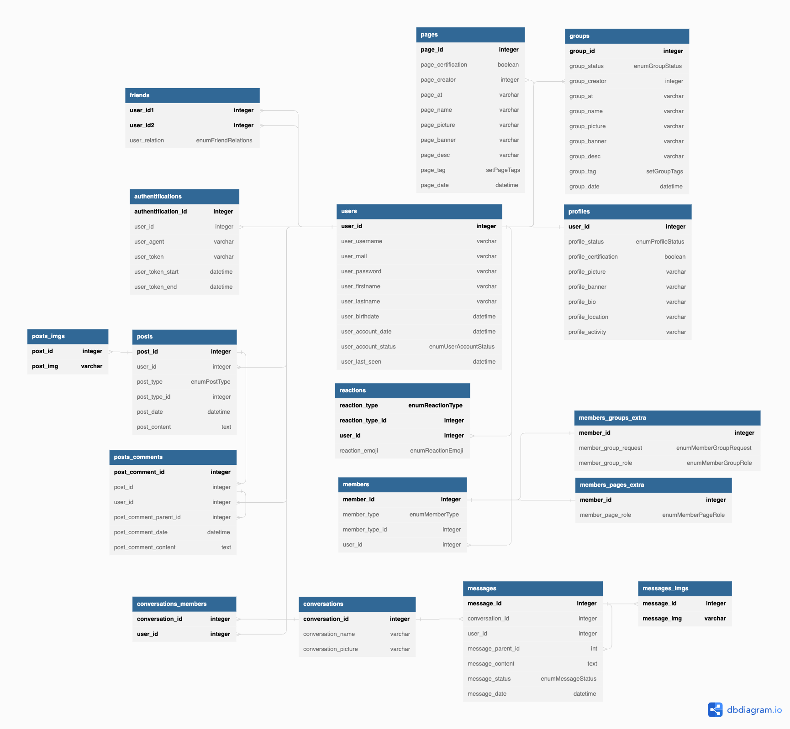

# Création de la BDD



```sql
CREATE DATABASE UniLink;

USE UNILINK;

CREATE TABLE users (
  user_id INT AUTO_INCREMENT PRIMARY KEY,
  user_username VARCHAR(255) NOT NULL UNIQUE,
  user_mail VARCHAR(255) NOT NULL UNIQUE,
  user_password VARCHAR(255) NOT NULL,
  user_firstname VARCHAR(255) NOT NULL,
  user_lastname VARCHAR(255) NOT NULL,
  user_birthdate DATE NOT NULL,
  user_account_date DATETIME DEFAULT CURRENT_TIMESTAMP NOT NULL,
  user_account_status ENUM ('disable', 'waiting', 'valid') DEFAULT 'waiting' NOT NULL
 );

/* DATETIME + 30 DAYS */
CREATE TABLE authentifications (
  authentification_id INT AUTO_INCREMENT PRIMARY KEY,
  user_id INT NOT NULL,
  user_username VARCHAR(255) NOT NULL UNIQUE,
  user_token VARCHAR(255) NOT NULL UNIQUE,
  user_token_start DATETIME NOT NULL,
  user_token_end DATETIME NOT NULL,
  FOREIGN KEY (user_id) REFERENCES users(user_id),
  FOREIGN KEY (user_username) REFERENCES users(user_username)
);

CREATE TABLE profiles (
  user_id INT PRIMARY KEY,
  profile_picture VARCHAR(255) NOT NULL DEFAULT "default_picture.jpg",
  profile_banner VARCHAR(255) NOT NULL DEFAULT "default_banner.jpg",
  profile_bio VARCHAR(255),
  profile_location VARCHAR(255),
  profile_activity VARCHAR(255),
  profile_certification BOOLEAN DEFAULT 0 NOT NULL,
  profile_status BOOLEAN DEFAULT 1 NOT NULL,
  FOREIGN KEY (user_id) REFERENCES users(user_id)
);

CREATE TABLE friends (
  user_id1 INT NOT NULL,
  user_id2 INT NOT NULL,
  user_relation ENUM('waiting', 'blocked', 'friend') DEFAULT 'waiting' NOT NULL,
  PRIMARY KEY (user_id1, user_id2),
  FOREIGN KEY (user_id1) REFERENCES users(user_id),
  FOREIGN KEY (user_id2) REFERENCES users(user_id)
);

CREATE TABLE groups (
  group_id INT AUTO_INCREMENT PRIMARY KEY,
  group_status BOOLEAN DEFAULT 0 NOT NULL,
  group_creator INT NOT NULL,
  group_at VARCHAR(255) NOT NULL UNIQUE,
  group_name VARCHAR(255) NOT NULL,
  group_picture VARCHAR(255),
  group_banner VARCHAR(255),
  group_desc VARCHAR(255),
  group_tag SET('tech', 'web', 'design', '3D'),
  group_date DATETIME DEFAULT CURRENT_TIMESTAMP NOT NULL,
  FOREIGN KEY (group_creator) REFERENCES users(user_id)
);

CREATE TABLE pages (
  page_id INT AUTO_INCREMENT PRIMARY KEY,
  page_creator INT NOT NULL,
  page_at VARCHAR(255) NOT NULL UNIQUE,
  page_name VARCHAR(255) NOT NULL,
  page_picture VARCHAR(255),
  page_banner VARCHAR(255),
  page_desc VARCHAR(255),
  page_tag SET('tech', 'web', 'design', '3D'),
  page_date DATETIME DEFAULT CURRENT_TIMESTAMP NOT NULL,
  page_certification BOOLEAN DEFAULT 0 NOT NULL,
  FOREIGN KEY (page_creator) REFERENCES users(user_id)
);

CREATE TABLE members (
  member_id INT AUTO_INCREMENT PRIMARY KEY,
  member_type ENUM('group', 'page') NOT NULL,
  member_type_id INT NOT NULL,
  user_id INT NOT NULL,
  UNIQUE KEY member_unique (user_id, member_type, member_type_id),
  FOREIGN KEY (user_id) REFERENCES users(user_id)
);

CREATE TABLE members_groups_extra (
  member_id INT PRIMARY KEY NOT NULL,
  member_group_request ENUM('waiting', 'blocked', 'accept') DEFAULT 'waiting' NOT NULL,
  member_group_role ENUM('admin', 'member', 'creator') DEFAULT 'member' NOT NULL,
  FOREIGN KEY (member_id) REFERENCES members(member_id)
);

CREATE TABLE members_pages_extra (
  member_id INT PRIMARY KEY NOT NULL,
  member_page_role ENUM('follower', 'admin') DEFAULT 'follower' NOT NULL,
  FOREIGN KEY (member_id) REFERENCES members(member_id)
);

CREATE TABLE posts (
  post_id INT AUTO_INCREMENT PRIMARY KEY,
  user_id INT NOT NULL,
  post_type ENUM('group', 'page', 'profile') NOT NULL,
  post_type_id INT NOT NULL,
  post_date DATETIME DEFAULT CURRENT_TIMESTAMP NOT NULL,
  post_content TEXT NOT NULL,
  FOREIGN KEY (user_id) REFERENCES users(user_id)
);

CREATE TABLE posts_imgs (
  post_id INT NOT NULL,
  post_img VARCHAR(255) NOT NULL,
  PRIMARY KEY (post_id, post_img),
  FOREIGN KEY (post_id) REFERENCES posts(post_id)
);

CREATE TABLE posts_comments (
  post_comment_id INT AUTO_INCREMENT PRIMARY KEY,
  post_comment_parent_id INT,
  post_id INT NOT NULL,
  user_id INT NOT NULL,
  post_comment_content TEXT NOT NULL,
  post_comment_date DATETIME DEFAULT CURRENT_TIMESTAMP NOT NULL,
  FOREIGN KEY (post_id) REFERENCES posts(post_id),
  FOREIGN KEY (user_id) REFERENCES users(user_id)
);

CREATE TABLE reactions (
  reaction_type ENUM('group', 'page', 'profil') NOT NULL,
  reaction_type_id INT NOT NULL,
  user_id INT NOT NULL,
  reaction_emoji ENUM('react1', 'react2', 'react3', 'react4', 'react5') NOT NULL,
  PRIMARY KEY (reaction_type, reaction_type_id, user_id),
  FOREIGN KEY (user_id) REFERENCES users(user_id)
);

CREATE TABLE conversations (
  conversation_id INT AUTO_INCREMENT PRIMARY KEY,
  conversation_name VARCHAR(255) NOT NULL,
  conversation_picture VARCHAR(255) NOT NULL
);

CREATE TABLE conversations_members (
  conversation_id INT NOT NULL,
  user_id INT NOT NULL,
  PRIMARY KEY (conversation_id, user_id),
  FOREIGN KEY (conversation_id) REFERENCES conversations(conversation_id),
  FOREIGN KEY (user_id) REFERENCES users(user_id)
);

CREATE TABLE messages (
  message_id INT AUTO_INCREMENT PRIMARY KEY,
  conversation_id INT NOT NULL,
  user_id INT NOT NULL,
  message_parent_id INT DEFAULT NULL,
  message_content TEXT NOT NULL,
  message_status ENUM('send', 'see') DEFAULT 'send' NOT NULL,
  message_date DATETIME DEFAULT CURRENT_TIMESTAMP NOT NULL,
  FOREIGN KEY (conversation_id) REFERENCES conversations(conversation_id),
  FOREIGN KEY (user_id) REFERENCES users(user_id)
);

CREATE TABLE messages_imgs (
  message_id INT NOT NULL,
  message_img VARCHAR(255) NOT NULL,
  PRIMARY KEY (message_id, message_img),
  FOREIGN KEY (message_id) REFERENCES messages(message_id)
);
```